# autofwd for herdr

**Automatic port forwarding for herdr's SSH machines**, like VS Code Remote-SSH. Start anything on
your server and it's on your computer's `localhost` a moment later, with a Ports panel to see, add and
edit forwards.

<p align="center">
  
</p>

**Try the panel right now, no server needed:**

```bash
git clone https://github.com/entrptaher/herdr-autofwd && cd herdr-autofwd && npm run demo
```

It runs the real panel against two pretend machines whose ports come and go. Add, edit and stop
forwards, and see what a conflict looks like. Press `q` to quit.

## What it does

- **Forwards automatically.** Anything that starts listening on a server (a dev server, the OAuth
  callback of a CLI login, a notebook) opens on your `localhost` within a second, on the same port.
  When it stops, the forward goes away.
- **Explains conflicts and never breaks.** If a port is already taken, the forward moves to the next
  free one and tells you who has it.
- **Reaches anything the server can.** Forward `db.internal:5432` or `10.0.0.5:8080` from the server,
  not just its own ports.
- **Installs nothing on your servers.** Everything runs on your computer over one SSH connection per
  machine.

## Quick start

Needs herdr 0.9+, Node.js 18+, OpenSSH, and Linux servers you reach with key-based SSH (ssh-agent, or a
key without a passphrase).

```bash
herdr plugin install entrptaher/herdr-autofwd   # or, from a clone: herdr plugin link .
herdr machine add my-server                     # your server, if it isn't saved in herdr yet
```

Restart herdr once. Then:

1. **Forwarding starts on its own** for every saved machine.
2. **Open the panel once:** `herdr plugin action invoke autofwd.ports`, while herdr shows your computer.
3. **Press `S` in the panel.** After that, **ctrl+b f** opens it from any machine, and herdr's tab row
   shows what's forwarded, like `⇄ 3000 5173`.

New servers need nothing extra: `herdr machine add` and they're forwarded too.

## The Ports panel

| Key | Mouse | What it does |
| --- | --- | --- |
| `↵` | double-click | Open in your browser |
| `e` | right-click → Edit… | Edit a forward: remote host, remote port, local port |
| `+` | "+ Add a forward" | Add a forward: a port on the server, or any `host:port` it can reach |
| `s` | right-click | Stop or resume (forwards you added are removed) |
| `c` | right-click | Copy the local address |
| `tab` | click a tab | Machines: auto-forward on/off, reconnect, notifications, the `S` setup |

The add/edit form takes Tab or clicks to move between fields, Enter or **Save** to save, and Esc to
cancel. Leave **Local port** empty for "the same port, or the next free one". If something's wrong,
the form stays open and says why. Nothing changes until you save something valid.

## Port conflicts

| When | What you see |
| --- | --- |
| Two machines serve the same port | The second gets the next free port: *localhost:8000 is used by the forward from dev-server (8000)* |
| A program on your computer has the port | Same, naming it: *localhost:8000 is used by node (pid 9240) on this computer* |
| You pick a local port that's taken | Refused in the form: *localhost:8000 is already used by the forward from dev-server (8000). Pick another local port.* |
| All 20 ports from that number up are taken | The row turns red and says so. Every other forward keeps working. |

Select a row to see its full message above the buttons. OAuth callbacks need their exact port: free it,
or press `e` and set it once it's free.

## How it works

```
 your computer                                          a server (saved machine)
 ┌──────────────────────────────────────┐   one SSH    ┌────────────────────────────────┐
 │ herdr ── starts ─▶ autofwd daemon     │  connection  │ port watcher (a shell script    │
 │                    · forwards         │◀────────────▶│ sent over SSH; nothing          │
 │ localhost:8000 ◀── · Ports panel      │ per machine  │ installed)                      │
 │                    · ⇄ indicator      │              │ your app on :8000               │
 └──────────────────────────────────────┘              └────────────────────────────────┘
```

The daemon starts with herdr and follows `herdr machine list`. For each machine it keeps one SSH
connection, watches the listening ports the way VS Code does (reading `/proc/net/tcp`), and adds or
removes forwards on that same connection. It skips other users' ports, so system services aren't
forwarded; add those with `+` if you want them.

<details>
<summary><b>What <code>S</code> changes</b> (the shortcut and the indicator)</summary>

herdr takes keybindings and its tab row from the machine you're viewing, so each machine needs a little
config. Pressing `S` adds:

- **On your computer:** a marked `# autofwd:begin` … `# autofwd:end` block in herdr's `config.toml`,
  with the ctrl+b f binding and a `tab_bar_right` indicator (left out if you already have one).
- **On each machine:** the same block, plus a small companion in `~/.local/share/herdr-autofwd/` (a
  manifest and one shell script) that shows the panel's window there. The panel itself still runs on
  your computer.

Every edit is checked with `herdr config check` and undone if herdr rejects it. Press `S` again to
remove it all; each config is restored exactly. Turn it off before you `herdr machine remove` a server.

</details>

<details>
<summary><b>Try it against real SSH servers</b> (Docker)</summary>

`demo/demo.sh up` starts two SSH servers in Docker Desktop that clash on the same ports, saves them in
herdr and starts forwarding. `demo/demo.sh down` removes everything. See
[demo/README.md](demo/README.md).

</details>

## Troubleshooting

- **A machine shows `retrying: Permission denied`:** `ssh -o BatchMode=yes <host> true` has to work, so
  run `ssh-add` first.
- **Nothing happens at all:** herdr starts the plugin with `node`, so Node must be on the `PATH` herdr
  started with. `herdr plugin log list --plugin autofwd` shows why.
- **Status from a terminal:** `node src/cli.js status`. Logs and saved choices are in
  `~/.local/state/herdr/plugins/autofwd/`.

## Development

Plain Node with no dependencies. `npm test` runs the panel and config tests, plus end-to-end tests
against real SSH servers in Docker.

| Path | What it is |
| --- | --- |
| `src/daemon.js` | Background process: machines, notifications, the indicator, the panel host |
| `src/forwarder.js` | One machine's SSH connection and its forwards |
| `src/panel.js` | The Ports panel, drawn into any terminal stream |
| `src/integration.js` | What `S` sets up, and how it's undone |
| `src/watch.sh` | The port watcher sent to each server |
| `companion/` | The panel's window on a server |
| `demo/` | `npm run demo`, and the Docker SSH servers |
| `demo/web/` | The panel in a browser, and the video tour (`#tour`): `node demo/web/build.js` builds one HTML page |
| `docs/demo/` | The animation above (`render.mjs` turns the captured frames into `demo.svg`) |
